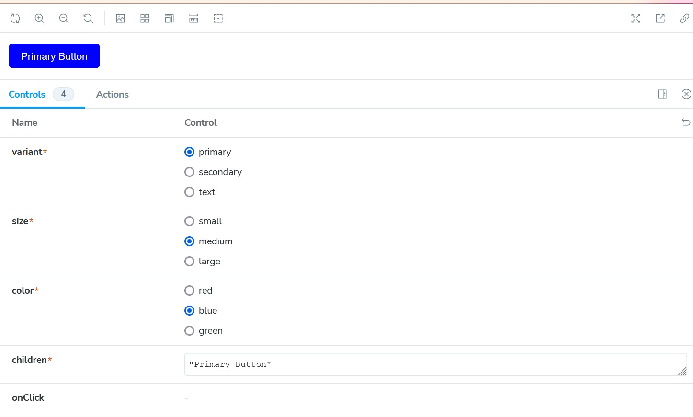
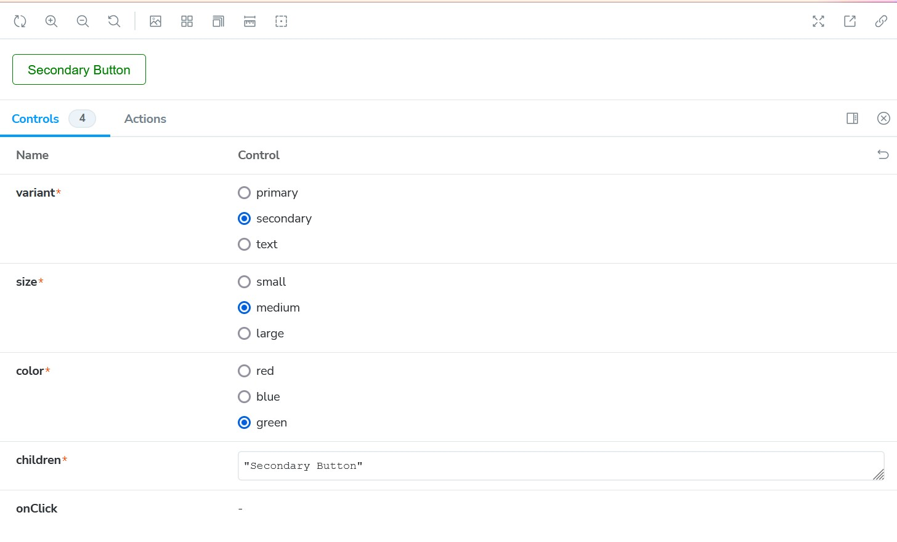
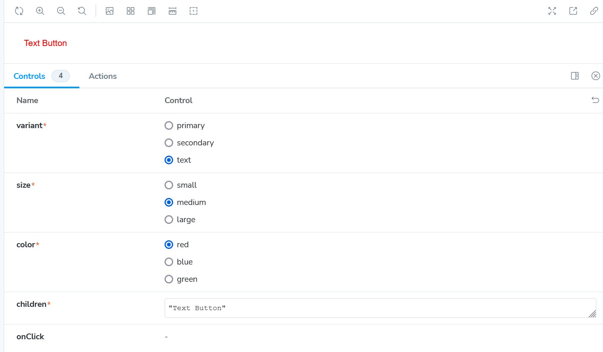

# React + TypeScript + Vite

Design System using Storybook

The design system includes a reusable Button component with multiple variants, sizes, and customizable colors. The component is showcased using Storybook, and the visual tests are published to Chromatic.
# Have a look

